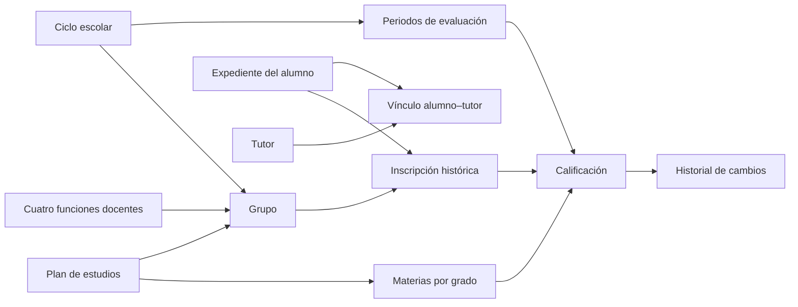

# Panel académico: guía de operación y alcance

Esta guía describe el panel administrativo ampliado. Sustituye las instrucciones del prototipo que pedían introducir IDs manualmente. El [análisis de RASE](analisis-base-datos-v1.md) conserva la evidencia del sistema anterior y el modelo conceptual completo; una entidad propuesta en ese análisis no implica que su módulo ya esté implementado.

## Recorrido recomendado

1. Inicia sesión con una cuenta administradora habilitada. La cuenta debe existir en Firebase Authentication y tener su perfil `users/{uid}` en Firestore.
2. Registra el plan de estudios y sus materias por grado. Indica la especialidad que imparte cada materia.
3. Registra los docentes: general, Educación Física, Inglés y Artes. Este registro representa al personal; no crea automáticamente una cuenta para iniciar sesión.
4. Crea el ciclo escolar, con sus fechas, y configura los periodos de evaluación.
5. Crea los grupos, vinculando ciclo, grado, plan y los cuatro docentes correspondientes.
6. Registra alumnos y tutores. Vincula cada tutor con sus alumnos, especificando parentesco y contacto principal. Un mismo tutor puede estar vinculado con hermanos sin duplicar su expediente.
7. Inscribe al alumno en el grupo. La inscripción enlaza su expediente con el ciclo escolar.
8. Abre Calificaciones y selecciona ciclo, grupo, alumno, materia y periodo. Guarda el valor y, cuando corresponda, su observación o motivo de corrección.
9. Consulta el historial del alumno y la actividad administrativa para comprobar el resultado.

Las listas se alimentan de Firestore. Si un selector está vacío, primero hay que registrar el catálogo del que depende. No se genera información escolar ficticia al abrir el panel.

## Relación entre módulos



El expediente guarda la identidad; la inscripción guarda la trayectoria. Cambiar de grupo no debe reemplazar las calificaciones anteriores ni convertir al grupo actual en el único dato histórico.

## Colecciones de esta versión

Los contratos TypeScript están en `src/types/models.ts`. Firestore guarda documentos con IDs internos; la CURP es un campo del expediente, no el identificador que aparece en las rutas.

| Colección | Datos principales y relaciones |
| --- | --- |
| `users` | Documento con ID igual al UID de Authentication; rol y habilitación de acceso |
| `students` | `names`, `surnames`, `curp`, `birthDate`, `sex`, `matricula`, `status` |
| `guardians` | `name`, `email`, `phone`, `address`, `education`, `occupation`, `status` |
| `studentGuardians` | `studentId`, `guardianId`, `relationship`, `primary`; relación N:M |
| `teachers` | `name`, `email`, `phone`, `specialty`, `status` |
| `schoolYears` | `name`, `startDate`, `endDate`, `status` |
| `curriculumPlans` | `name`, `version`, `status` |
| `subjectPlans` | `curriculumPlanId`, `grade`, `name`, `specialty`, `status` |
| `groups` | `schoolYearId`, `curriculumPlanId`, `grade`, `label`, `shift`, `status` y los cuatro IDs de docentes |
| `gradingPeriods` | `schoolYearId`, `name`, `order`, `startDate`, `endDate`, `status` |
| `enrollments` | `studentId`, `groupId`, `schoolYearId`, `startDate`, `endDate`, `status`, `reason` |
| `grades` | Inscripción, alumno, grupo, ciclo, materia, periodo, valor, redondeo, responsable y observaciones |
| `grades/{gradeId}/history` | Versiones previas de una calificación y motivo del cambio |
| `auditLogs` | Recurso, acción, actor y fecha de las operaciones registradas |
| `studentIdentifiers` | Reservas de CURP y matrícula para evitar duplicados, vinculadas al ID del alumno |
| `guardianSlots` | Referencia al vínculo del tutor principal de cada alumno |
| `enrollmentSlots` | Inscripción vigente y movimiento anterior por alumno y ciclo |
| `academicSettings/currentYear` | Referencia al único ciclo activo, o vacía cuando no hay ninguno |

Las cuatro últimas son estructuras técnicas: no se capturan a mano ni se muestran como catálogos. Se actualizan en la misma transacción que el expediente o movimiento correspondiente. Sus reglas comprueban el estado posterior de todos los documentos implicados para impedir reservas o referencias contradictorias. Los IDs del índice `studentIdentifiers` contienen el identificador reservado; esa colección es privada, al igual que los expedientes.

Cada registro académico guarda revisión, fechas, actor y referencia a la operación de auditoría. `auditLogs` conserva también el documento anterior; no permite editar ni borrar sus entradas desde el panel. La vista Actividad consulta solamente los últimos 100 movimientos, no borra los más antiguos. Identifica la cuenta actual por su nombre y otras cuentas por su UID, sin inventar identidades.

El modelo conceptual inicial incluía `subjects`, `PLAN_GRADO` y `teachingAssignments`. Esta entrega simplifica el catálogo de materias en `subjectPlans` por plan y grado, y representa las cuatro funciones docentes mediante referencias explícitas en el grupo. No existe todavía una gestión independiente de vigencias históricas de asignaciones docentes. Si se amplían las especialidades o sus periodos de asignación, deberá evolucionarse esa parte del modelo.

## Campos y referencia del sistema anterior

| Módulo nuevo | Información que representa | Referencia documentada de RASE |
| --- | --- | --- |
| Alumnos | CURP, nombres, apellidos, nacimiento y estado del expediente | `ALUMNOGRAL` |
| Tutores y vínculos | Nombre, correo, teléfono, domicilio, escolaridad, ocupación y relación con cada alumno | Datos familiares repetidos en `ALUMNOGRAL`; ahora la relación es N:M |
| Docentes | Identidad del personal, contacto y especialidad docente | `PERSONAL`; sustituye columnas de grupo repetidas |
| Ciclos y periodos | Fechas del ciclo y ventanas de evaluación | `DET_CICLOS` |
| Grupos e inscripciones | Grado, grupo, turno, altas, bajas y cambios de grupo | `ALUMNOCICLO` y referencias a grupo en las tablas académicas |
| Planes y materias | Materias por plan y grado, con función docente | `MATERIASCAT` |
| Calificaciones e historial | Valor por inscripción, materia y periodo; trazabilidad de correcciones | `CALIFACAD` y `CALIFCICLO`; sustituye columnas materia/periodo repetidas |
| Actividad | Registro de operaciones administrativas del panel | Necesidad de trazabilidad del sistema nuevo |

La tabla se basa en la auditoría documentada; no atribuye a RASE flujos de interfaz que no se verificaron. No se importan automáticamente los datos personales del ZIP. El historial de esta versión se construye con los registros del sistema nuevo.

## Decisiones de operación

- La escala aprobada es de 0 a 10. El prototipo conserva el valor capturado y calcula también su redondeo al entero más cercano. Esto es una regla técnica inicial, no una certificación de la política oficial de evaluación.
- Los tres periodos son el punto de partida observado en los ciclos recientes del archivo. Los nombres y las fechas se configuran para el ciclo nuevo; no se copian calendarios históricos.
- La dirección administra las correcciones. Un periodo o ciclo cerrado bloquea calificaciones nuevas, pero permite corregir una existente con motivo obligatorio, incremento de versión e historial atómico. No hace falta reabrirlo para una corrección. El cierre y la reapertura también quedan registrados; no hay envío ni validación ante SEP.
- Cada grupo utiliza cuatro funciones: general, Educación Física, Inglés y Artes. El registro de un docente y la cuenta con la que se autentica son conceptos distintos.
- Solo puede existir un ciclo activo. Las fechas de un ciclo y la especialidad de un registro docente no se modifican después del alta; los formularios lo indican. Las fechas de los periodos sí se pueden editar dentro del ciclo, sin cruzarse entre periodos.
- Una inscripción activa por alumno y ciclo. El cambio de grupo cierra la anterior con motivo y crea otra, sin trasladar ni sobrescribir calificaciones. La baja cierra la inscripción, no elimina el expediente. Los movimientos de ciclos cerrados se consultan sin acciones desde Inscripciones.
- El panel no ofrece eliminación física de expedientes ni historiales. Los catálogos se inactivan o cierran cuando corresponde. Antes de inactivar un alumno con inscripción vigente, registra su baja.
- La conservación indefinida es el requisito acordado. No equivale a contar con copias de seguridad automáticas: estas requieren una política y una implementación propias.

## Acceso y límites de esta entrega

El panel ampliado es administrativo. Firebase Authentication comprueba la identidad y Firestore exige un perfil `users/{uid}` con `role: 'admin'` y `active: true`. Dar de alta un docente o un tutor no les concede acceso. El navegador no puede crear ni modificar roles de usuarios. Las vistas restringidas de docentes, alumnos y tutores requieren todavía su flujo de asignación y permisos; no deben habilitarse compartiendo una cuenta administradora.

El panel usa el SDK de Firestore directamente, con reglas de seguridad, para funcionar con la configuración gratuita existente. Las Cloud Functions del repositorio no forman parte de este recorrido ni son necesarias para probarlo: son un prototipo pendiente de revisión y no deben desplegarse en esta entrega. No debe publicarse únicamente la interfaz: las reglas actualizadas forman parte del mismo cambio.

Esta primera versión mantiene sus catálogos en memoria mediante suscripciones de Firestore. Todavía no incorpora paginación de expedientes ni consultas por grupo para todas las colecciones. Antes de ampliar significativamente el volumen deberá optimizarse ese acceso y revisarse el consumo; no se promete capacidad ilimitada dentro del plan gratuito.

No hay generación de cuentas desde el navegador, importación de RASE, integraciones SEP ni emisión de documentos oficiales en esta entrega. Los catálogos e historiales guardados pertenecen al proyecto Firebase configurado; una sesión de desarrollo local no crea por sí misma una base separada.

## Verificación manual con datos de prueba

Usa el entorno de emuladores cuando esté disponible y datos ficticios reconocibles. La secuencia anterior permite probar el recorrido completo sin usar expedientes reales.

Comprueba al menos:

1. Un visitante sin sesión no puede abrir el panel ni leer los expedientes.
2. Un perfil sin permisos administrativos no puede guardar información académica.
3. Los catálogos creados aparecen en los selectores que dependen de ellos.
4. Una calificación reaparece al recargar y su corrección conserva el registro previo.
5. Un traslado conserva la inscripción anterior y sus calificaciones.
6. Un periodo cerrado rechaza nuevas capturas. La dirección sí puede corregir una calificación existente con motivo obligatorio, y queda registrada su versión anterior.
7. Los estados vacíos y los errores de conexión se muestran sin anunciar que una operación fallida se guardó.
8. No se puede registrar otra CURP o matrícula ya reservada, ni dejar dos tutores principales o dos inscripciones activas para el mismo alumno y ciclo.
9. No se puede activar un segundo ciclo sin cerrar el actual, ni guardar periodos con fechas cruzadas.

## Pruebas automatizadas locales

Desde la raíz del repositorio:

```powershell
npm ci
npm run build
npm run lint
npm run test:rules
npm run test:e2e
```

`test:rules` ejecuta las pruebas de autorización e integridad de `tests/rules.test.mjs` contra el emulador de Firestore. `test:e2e` inicia Authentication y Firestore locales, prepara usuarios ficticios y recorre el navegador con Playwright: acceso, catálogos, expediente, tutor, inscripción, captura, corrección, persistencia, traslado y baja. La configuración está en `playwright.config.ts` y las capturas/trazas se escriben en `test-results/`, fuera de Git.

Para estas pruebas necesitas Java 21 y, para el navegador configurado, Google Chrome instalado. Ejecuta las suites una después de otra; utilizan puertos locales fijos y limpian sus datos de emulador. Playwright configura Vite con un proyecto `demo-` y `VITE_USE_EMULATORS=true`: no necesita credenciales reales ni toca los expedientes alojados en Firebase. No cambies sus proyectos de prueba por un proyecto real. Detén cualquier emulador que ya ocupe 8080 o 9099 antes de ejecutarlas.

## Pendientes acordados para avances posteriores

Asistencia, planeación, diagnóstico y seguimiento siguen pendientes por decisión del proyecto. También quedan para después las notificaciones, solicitudes formales de corrección, documentos oficiales (constancias, boletas y sus formatos), la integración SEP y la administración del contenido institucional. Esta lista debe revisarse al planear cada siguiente entrega.
